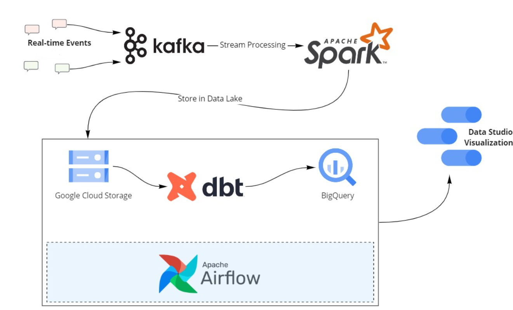
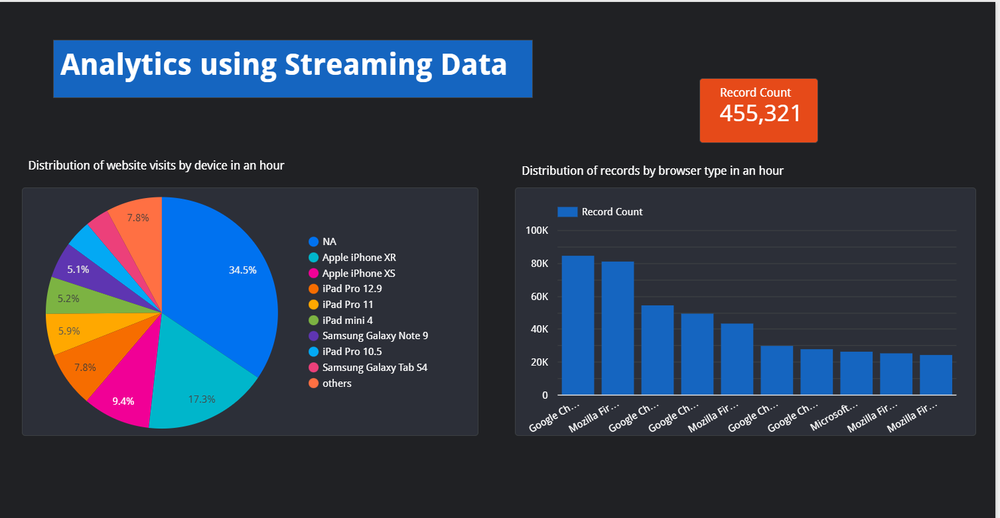

# Data Engineering Project for Streaming Data:

## Intro:
This is a basic Data Engineering Final Project for Data Engineering Zoomcamp. I am using FakeData generator module written in Python3 to generate fake streaming data for a fake website. The streaming dataset contains number of clicks on website, device used, network etc. I am using Kafka producer to produce streaming data in kafka broker after which Spark Streaming will consume this data and store it in Data lake hosted on GCP. Then, dbt and airflow is used in a docker to apply transformations on data lake and store it in BigQuery. Finally, Google Studio is used to create dashboard. The infrastructure hosted in GCP is automated using Terraform.

## Data:
Dataset used in this project is web activity on a website. All of the data is fake and is generated through Faka Data generator module written in Python3. It generate data with the speed of 1 row per second.

## Technologies Used:
- Python3
- Terraform
- GCP
- dbt
- Docker
- Kafka
- Spark Streaming

## Architecture:


## Dashboard:


## Steps to Execute the Project:
First, you should have a working GCP account and Terraform module in your local computer. Setup is given in datatalk github page:
- GCP https://github.com/ankurchavda/streamify/blob/main/setup/gcp.md
- Terraform https://github.com/DataTalksClub/data-engineering-zoomcamp/blob/main/week_1_basics_n_setup/1_terraform_gcp/windows.md#terraform

You will need to give extra permissions for VM instances, dataproc and firewall in IAM roles in service account page in GCP.

## Terraform Setup:
Open terminal and type the following commands:

``` git clone https://github.com/sadiayousafzai036/FinalProject.git```

``` cd FinalProject/setups```

``` bash terraform.sh```

This will install terraform dependencies necessary for GCP on your system. Now to deploy the infrastructure, execute the below commands:

``cd FinalProject/terraform/```

```terraform init```

```terraform plan```

```terraform apply```

If everything goes well, you will see instances for two empty datasets in BigQuery, airflow, spark cluster and kafka in your VM instances page on GCP.
Note down their external ips and add them in your config file.

Possible error: If you get errors like unauthorized permission to create resources on GCP, please check the path for google_credentials.json file in the below command:

```export GOOGLE_APPLICATION_CREDENTIALS="<path>/google_credentials.json" ```

## Kafka Setup:

You will need to have two sessions for Kafka setup using vm kafka-instance.
Open gitbash and execute this for creating sessions : ```ssh kafka-instance```
# Kafka First Session:

Execute the below command to clone the repo:

``` git clone https://github.com/sadiayousafzai036/FinalProject.git```

``` bash FinalProject/setups/docker_conda.sh ```

Close the session and open it again:

``` cd FinalProject/kafka```

``` export KAFKA_ADDRESS=<external ip address of kafka-instance vm>```

Execute the below command to start kafka instance:

```docker-compose up```

# Kafka Second Session:

Execute the below command to clone the repo:

``` git clone https://github.com/sadiayousafzai036/FinalProject.git```

``` bash FinalProject/setups/docker_conda.sh ```

Close the session and open it again:

``` cd FinalProject/kafka```

``` export KAFKA_ADDRESS=<external ip address of kafka-instance vm>```

``` python3 generate_dataset_to_kafka.py```

Second session will generate streaming data for session 1 kafka instance to produce it on kafka broker in partitions using topic 'raw_data`.

## Spark Streaming:

You will need to use a seperate spark session to login into master spark machine vm.

execute ```ssh multinode-spark-cluster-m```

Execute the below command to clone the repo and install spark dependencies:

``` git clone https://github.com/sadiayousafzai036/FinalProject.git```

``` bash FinalProject/setups/spark.sh ```

Configure environment variables:

```export KAFKA_ADDRESS=<external ip address of kafka-instance>```

```export GCP_GCS_BUCKET=<bucket name used in creating data (remember terraform apply?)>```

```export GOOGLE_APPLICATION_CREDENTIALS="<path>/google_credentials.json" ```

To consume data from kafka broker using spark streaming, execute:

``` cd FinalProject/spark_streaming/```

``` spark-submit --packages org.apache.spark:spark-sql-kafka-0-10_2.12:3.1.2 stream_data.py ```

If there are no errors along the way, you will see files in Google Cloud Storage Data Lake!

## Airflow and dbt:

You will need to use the session dedicated for airflow-intance.

execute ```ssh airflow-instance```

Execute the below command to clone the repo and install spark dependencies:

``` git clone https://github.com/sadiayousafzai036/FinalProject.git```

``` bash FinalProject/setups/docker_conda.sh ```

``` bash FinalProject/setups/airflow.sh ```

Setup environment variables

```export GOOGLE_APPLICATION_CREDENTIALS="<path>/google_credentials.json" ```
```export GCP_PROJECT_ID=project-id```
```export GCP_GCS_BUCKET=bucket-name```

Forward the port 8080 to your local machine and open localhost:8080 in your browser. Trigger the "transform" dag which will execute hourly.

## Dashboard

Click on this link to see the dashboard
https://datastudio.google.com/reporting/923207af-b356-4586-a349-e3a050303b38
